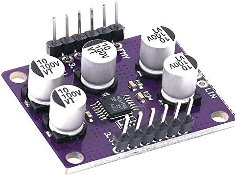
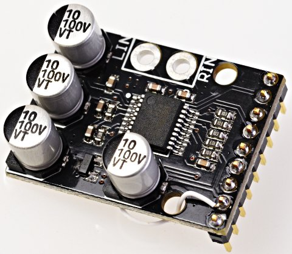

# Pico I2S

A simple implementation of the I²S (Inter-IC Sound) protocol for the Raspberry Pi Pico (RP2040).

# Hardware

## ADC

### PCM1808 Module

#### Wiring

| PCM1808 | RPi Pico | Notes             |
| ------- | -------- | ----------------- |
| +5V     | VBUS     |                   |
| 3.3     | 3V3      |                   |
| GND     | GND      |                   |
| SCK     | GPIO16   |                   |
| BCK     | GPIO17   |                   |
| LRC     | GPIO18   |                   |
| OUT     | GPIO19   |                   |
| FMY     | -        | Leave unconnected |
| MD0     | -        | Leave unconnected |
| MD1     | -        | Leave unconnected |

#### Checked Configurations

| RP2040 Frequency | Sample Rate | SCK multiplier | I2S Frame Size | Notes                                  |
| ---------------- | ----------- | -------------- | -------------- | -------------------------------------- |
| 192 MHz          | 8 kHz       | 256            | 32             | ✅                                     |
| 192 MHz          | 44.1 kHz    | 256            | 32             | ❌ Unable to set a valid clock divider |
| 192 MHz          | 48 kHz      | 256            | 32             | ✅                                     |
| 192 MHz          | 96 kHz      | 256            | 32             | ✅                                     |

### PCM1802 Module

#### Solder Pads

Solder a bridge between the `FMT0` pad and the `+` pad.
On some faulty PCM1802 modules it should be [directly connected to the `3.3V` pin with a wire](https://www.pjrc.com/pcm1802-breakout-board-needs-hack/).

#### Wiring

| PCM1808 | RPi Pico | Notes                                                               |
| ------- | -------- | ------------------------------------------------------------------- |
| +5V     | VBUS     |                                                                     |
| 3.3V    | -        | Leave unconnected. The module contains a built-in voltage regulator |
| GND     | GND      |                                                                     |
| SCK     | GPIO16   |                                                                     |
| BCK     | GPIO17   |                                                                     |
| LRCK    | GPIO18   |                                                                     |
| DOUT    | GPIO19   |                                                                     |
| FSY     | 3V3      | Can be connected to the `3.3V` pin on the module                    |
| POW     | 3V3      | Can be connected to the `3.3V` pin on the module                    |

#### Checked Configurations

| RP2040 Frequency | Sample Rate | SCK multiplier | I2S Frame Size | Notes                                  |
| ---------------- | ----------- | -------------- | -------------- | -------------------------------------- |
| 192 MHz          | 16 kHz      | 256            | 32             | ✅                                     |
| 192 MHz          | 44.1 kHz    | 256            | 32             | ❌ Unable to set a valid clock divider |
| 192 MHz          | 48 kHz      | 256            | 32             | ✅                                     |
| 192 MHz          | 96 kHz      | 256            | 32             | ✅                                     |
